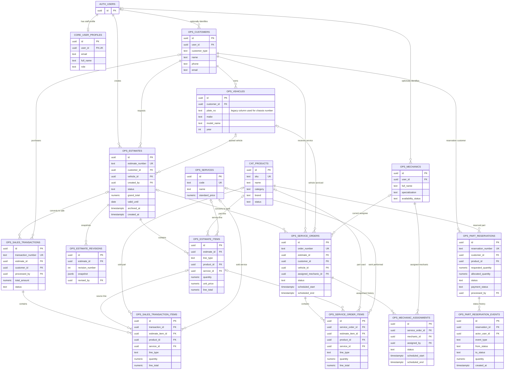
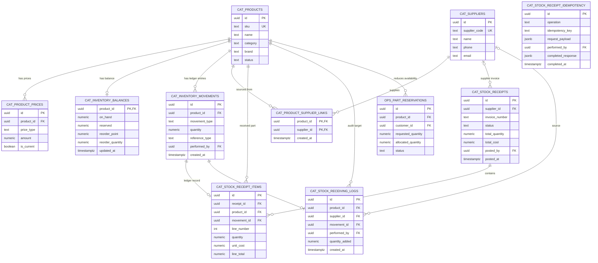
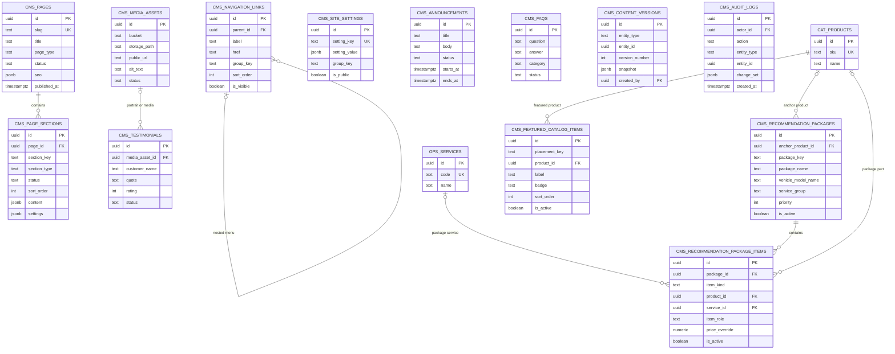
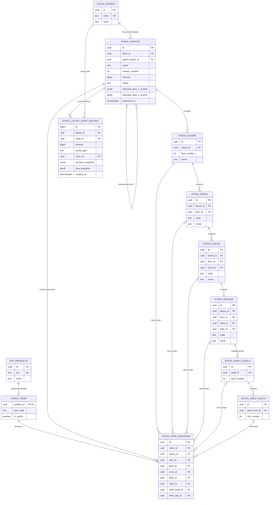
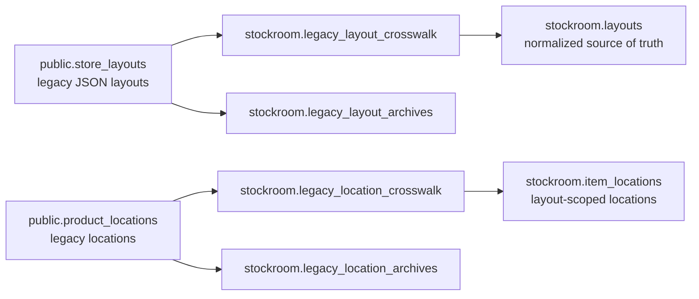

# LimenServe Current ERD

This document is the simplified ERD for the current LimenServe database. It was checked against the live Supabase project and repository migrations on **August 24, 2026**.

The model is split into four diagrams so the important connections stay readable:

1. Customer, quotation, sales, service, and reservations
2. Catalogue, suppliers, and transactional stock receiving
3. CMS content and catalogue recommendations
4. Normalized 3D stockroom and legacy compatibility

`auth.users` is owned by Supabase Auth. Application tables live in `core`, `operations`, `catalog`, `cms`, and `stockroom`. Public RPC functions are API boundaries and are not physical ERD entities.

> To edit these diagrams in Draw.io, open **Arrange → Insert → Advanced → Mermaid** and paste one Mermaid block at a time.

## 1. Core business flow

### Business rules represented here

- A customer record is not the same as a login. Staff can create customers, quotations, and part reservations without creating customer accounts.
- `estimate_items`, `sales_transaction_items`, and `service_order_items` are line-item tables. A line points to a product or a service according to `line_type`.
- `estimate_number` is the public quotation identifier; the UUID remains the internal primary key.
- Expiry uses `valid_until`. Staff hiding of sent quotations uses `archived_at`; it does not erase business history. Drafts may be deleted through the controlled application workflow.
- The UI calls the vehicle field **Chassis Number**, but the current physical column is still `operations.vehicles.plate_no` for backward compatibility. Rename it only through a reviewed migration and compatibility period.
- `service_orders.assigned_mechanic_id` is the current assignee. `mechanic_assignments` keeps scheduling and assignment history.
- Reservations store the customer, product, requested/allocated quantity, payment status, processor, and an append-only event history.

## 2. Catalogue and transactional receiving

`catalog.stock_receipt_idempotency` intentionally has no direct foreign key to a receipt because it records the request and completed response for more than one receiving operation. It is a private replay-protection ledger, not an application-facing table.

The receiving RPC is the transaction boundary. Within one database transaction it validates the idempotency key, locks products in a stable order, updates `inventory_balances`, inserts `inventory_movements`, links the supplier, writes the receipt and its items, and writes the receiving audit log. A failure rolls back the complete operation.

## 3. CMS and recommendations

The old single `CMS` box is no longer accurate. Pages, reusable sections, navigation, site settings, media, announcements, FAQs, testimonials, featured products, and packages are independently managed.

`content_versions` and `audit_logs` use the generic pair `entity_type + entity_id` so they can record many CMS entity types. Those generic references are intentionally not physical foreign keys, so they are shown without misleading relationship lines.

## 4. Normalized 3D stockroom

The normalized `stockroom` schema is the long-term source of truth. Store and layout IDs scope every product placement. Composite foreign keys also prevent a floor, zone, aisle, shelf, level, or slot from being combined with the wrong layout hierarchy.

`layouts.revision` supports optimistic concurrency. `status`, `parent_layout_id`, and `published_at` support separate drafts, saved designs, and a selected published layout. `layout_audit_history` preserves publish and edit history.

### Legacy compatibility path

The public legacy tables remain available during migration. Crosswalk and archive tables preserve traceability. Do not delete the legacy path until all rows are migrated, application reads use the normalized model, and migration/rollback tests cover the production data shape.

## What changed from the old ERD

- Split customer identity from Supabase authentication and staff profiles.
- Added vehicles as a first-class customer entity.
- Added estimate revisions, archive state, sales/service line items, and conversion paths.
- Added mechanics and assignment history.
- Added admin-managed part reservations, payment state, allocation, and event history.
- Added supplier links, stock receipts, receipt items, transactional movements, receiving audit logs, and idempotency protection.
- Replaced the single CMS entity with the actual content, navigation, media, versioning, audit, featured-product, and recommendation tables.
- Replaced the unscoped locator model with store/layout/floor/zone/aisle/shelf/level/slot relationships.
- Kept legacy layout/location data through explicit compatibility and archive tables.

## Deliberate exclusions

This document focuses on the operational model. OCR/import staging, generated pricelist staging, analytics/reporting tables, notification delivery, backup tables, indexes, triggers, RLS policies, and RPC functions are excluded so the ERD stays readable. They should be documented in their own data-flow or security diagrams rather than added to this relationship map.
