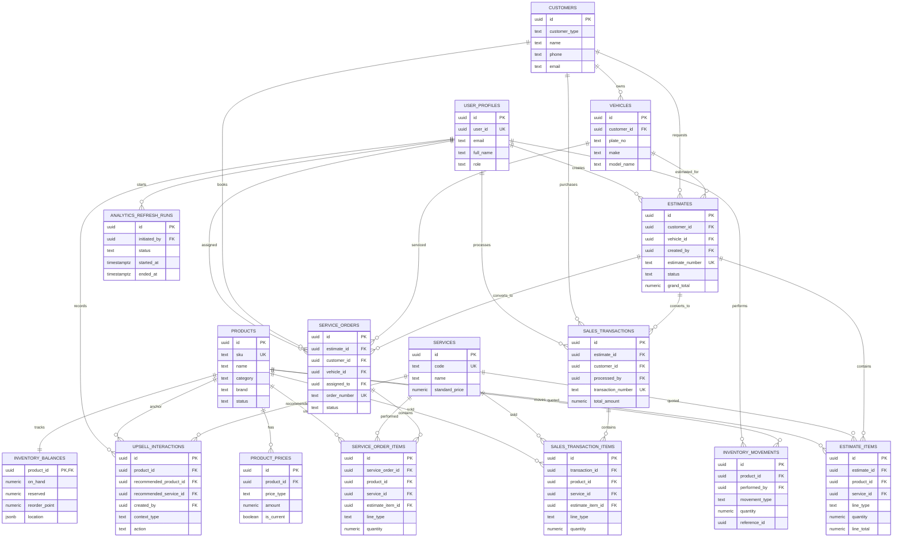

# ERD

## Operational ERD

```mermaid
erDiagram
    USER_PROFILES {
        uuid id PK
        uuid user_id UK
        text email
        text full_name
        text role
    }

    PRODUCTS {
        uuid id PK
        text sku UK
        text name
        text category
        text brand
        text status
    }

    PRODUCT_PRICES {
        uuid id PK
        uuid product_id FK
        text price_type
        numeric amount
        boolean is_current
    }

    INVENTORY_BALANCES {
        uuid product_id PK,FK
        numeric on_hand
        numeric reserved
        numeric reorder_point
        jsonb location
    }

    INVENTORY_MOVEMENTS {
        uuid id PK
        uuid product_id FK
        uuid performed_by FK
        text movement_type
        numeric quantity
        uuid reference_id
    }

    CUSTOMERS {
        uuid id PK
        text customer_type
        text name
        text phone
        text email
    }

    VEHICLES {
        uuid id PK
        uuid customer_id FK
        text plate_no
        text make
        text model_name
    }

    SERVICES {
        uuid id PK
        text code UK
        text name
        numeric standard_price
    }

    ESTIMATES {
        uuid id PK
        uuid customer_id FK
        uuid vehicle_id FK
        uuid created_by FK
        text estimate_number UK
        text status
        numeric grand_total
    }

    ESTIMATE_ITEMS {
        uuid id PK
        uuid estimate_id FK
        uuid product_id FK
        uuid service_id FK
        text line_type
        numeric quantity
        numeric line_total
    }

    SALES_TRANSACTIONS {
        uuid id PK
        uuid estimate_id FK
        uuid customer_id FK
        uuid processed_by FK
        text transaction_number UK
        numeric total_amount
    }

    SALES_TRANSACTION_ITEMS {
        uuid id PK
        uuid transaction_id FK
        uuid product_id FK
        uuid service_id FK
        uuid estimate_item_id FK
        text line_type
        numeric quantity
    }

    SERVICE_ORDERS {
        uuid id PK
        uuid estimate_id FK
        uuid customer_id FK
        uuid vehicle_id FK
        uuid assigned_to FK
        text order_number UK
        text status
    }

    SERVICE_ORDER_ITEMS {
        uuid id PK
        uuid service_order_id FK
        uuid product_id FK
        uuid service_id FK
        uuid estimate_item_id FK
        text line_type
        numeric quantity
    }

    UPSELL_INTERACTIONS {
        uuid id PK
        uuid product_id FK
        uuid recommended_product_id FK
        uuid recommended_service_id FK
        uuid created_by FK
        text context_type
        text action
    }

    ANALYTICS_REFRESH_RUNS {
        uuid id PK
        uuid initiated_by FK
        text status
        timestamptz started_at
        timestamptz ended_at
    }

    USER_PROFILES ||--o{ ESTIMATES : "creates"
    USER_PROFILES ||--o{ INVENTORY_MOVEMENTS : "performs"
    USER_PROFILES ||--o{ SALES_TRANSACTIONS : "processes"
    USER_PROFILES ||--o{ SERVICE_ORDERS : "assigned"
    USER_PROFILES ||--o{ UPSELL_INTERACTIONS : "records"
    USER_PROFILES ||--o{ ANALYTICS_REFRESH_RUNS : "starts"

    PRODUCTS ||--o{ PRODUCT_PRICES : "has"
    PRODUCTS ||--|| INVENTORY_BALANCES : "tracks"
    PRODUCTS ||--o{ INVENTORY_MOVEMENTS : "moves"
    PRODUCTS ||--o{ ESTIMATE_ITEMS : "quoted"
    PRODUCTS ||--o{ SALES_TRANSACTION_ITEMS : "sold"
    PRODUCTS ||--o{ SERVICE_ORDER_ITEMS : "used"
    PRODUCTS ||--o{ UPSELL_INTERACTIONS : "anchor"

    CUSTOMERS ||--o{ VEHICLES : "owns"
    CUSTOMERS ||--o{ ESTIMATES : "requests"
    CUSTOMERS ||--o{ SALES_TRANSACTIONS : "purchases"
    CUSTOMERS ||--o{ SERVICE_ORDERS : "books"

    VEHICLES ||--o{ ESTIMATES : "estimated_for"
    VEHICLES ||--o{ SERVICE_ORDERS : "serviced"

    SERVICES ||--o{ ESTIMATE_ITEMS : "quoted"
    SERVICES ||--o{ SALES_TRANSACTION_ITEMS : "sold"
    SERVICES ||--o{ SERVICE_ORDER_ITEMS : "performed"
    SERVICES ||--o{ UPSELL_INTERACTIONS : "recommended"

    ESTIMATES ||--o{ ESTIMATE_ITEMS : "contains"
    ESTIMATES ||--o{ SALES_TRANSACTIONS : "converts_to"
    ESTIMATES ||--o{ SERVICE_ORDERS : "converts_to"

    SALES_TRANSACTIONS ||--o{ SALES_TRANSACTION_ITEMS : "contains"
    SERVICE_ORDERS ||--o{ SERVICE_ORDER_ITEMS : "contains"
```

## Analytics ERD

```mermaid
erDiagram
    DIM_DATE {
        int date_key PK
        date full_date
    }

    DIM_PRODUCT {
        int product_key PK
        uuid source_product_id UK
        text sku
        text name
    }

    DIM_SERVICE {
        int service_key PK
        uuid source_service_id UK
        text code
        text name
    }

    DIM_VEHICLE_MODEL {
        int vehicle_model_key PK
        text source_model_name UK
    }

    DIM_CUSTOMER_TYPE {
        int customer_type_key PK
        text source_customer_type UK
    }

    DIM_EMPLOYEE {
        int employee_key PK
        uuid source_user_id UK
        text role
    }

    FACT_ESTIMATE_LINES {
        bigint fact_id PK
        uuid estimate_id
        uuid estimate_item_id UK
        int date_key FK
        int product_key FK
        int service_key FK
    }

    FACT_SALES_LINES {
        bigint fact_id PK
        uuid transaction_id
        uuid transaction_item_id UK
        int date_key FK
        int product_key FK
        int service_key FK
    }

    FACT_SERVICE_ORDER_LINES {
        bigint fact_id PK
        uuid service_order_id
        uuid service_order_item_id UK
        int date_key FK
        int product_key FK
        int service_key FK
    }

    FACT_MONTHLY_PRODUCT_DEMAND {
        int month_key PK
        int product_key PK
        numeric quantity
        numeric revenue
    }

    FACT_MONTHLY_SERVICE_DEMAND {
        int month_key PK
        int service_key PK
        numeric quantity
        numeric revenue
    }

    PRODUCT_MONTHLY_FORECASTS {
        uuid id PK
        uuid product_id FK
        date target_month
        numeric predicted_quantity
    }

    SERVICE_MONTHLY_FORECASTS {
        uuid id PK
        uuid service_id FK
        date target_month
        numeric predicted_quantity
    }

    PRODUCT_ASSOCIATION_RULES {
        uuid id PK
        uuid antecedent_product_id FK
        uuid consequent_product_id FK
        uuid consequent_service_id FK
    }

    SERVICE_ASSOCIATION_RULES {
        uuid id PK
        uuid antecedent_service_id FK
        uuid consequent_product_id FK
        uuid consequent_service_id FK
    }

    DIM_DATE ||--o{ FACT_ESTIMATE_LINES : "filters"
    DIM_DATE ||--o{ FACT_SALES_LINES : "filters"
    DIM_DATE ||--o{ FACT_SERVICE_ORDER_LINES : "filters"
    DIM_PRODUCT ||--o{ FACT_ESTIMATE_LINES : "joins"
    DIM_PRODUCT ||--o{ FACT_SALES_LINES : "joins"
    DIM_PRODUCT ||--o{ FACT_SERVICE_ORDER_LINES : "joins"
    DIM_PRODUCT ||--o{ FACT_MONTHLY_PRODUCT_DEMAND : "aggregates"
    DIM_SERVICE ||--o{ FACT_ESTIMATE_LINES : "joins"
    DIM_SERVICE ||--o{ FACT_SALES_LINES : "joins"
    DIM_SERVICE ||--o{ FACT_SERVICE_ORDER_LINES : "joins"
    DIM_SERVICE ||--o{ FACT_MONTHLY_SERVICE_DEMAND : "aggregates"
    DIM_EMPLOYEE ||--o{ FACT_ESTIMATE_LINES : "credits"
    DIM_EMPLOYEE ||--o{ FACT_SALES_LINES : "credits"
    DIM_EMPLOYEE ||--o{ FACT_SERVICE_ORDER_LINES : "credits"
```
